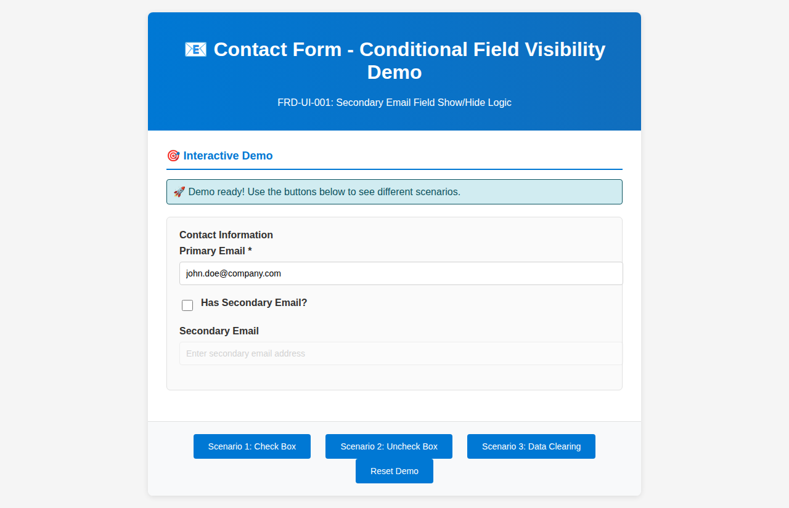
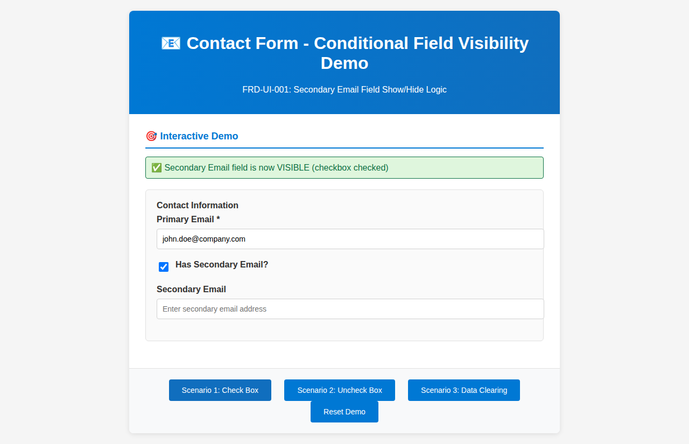
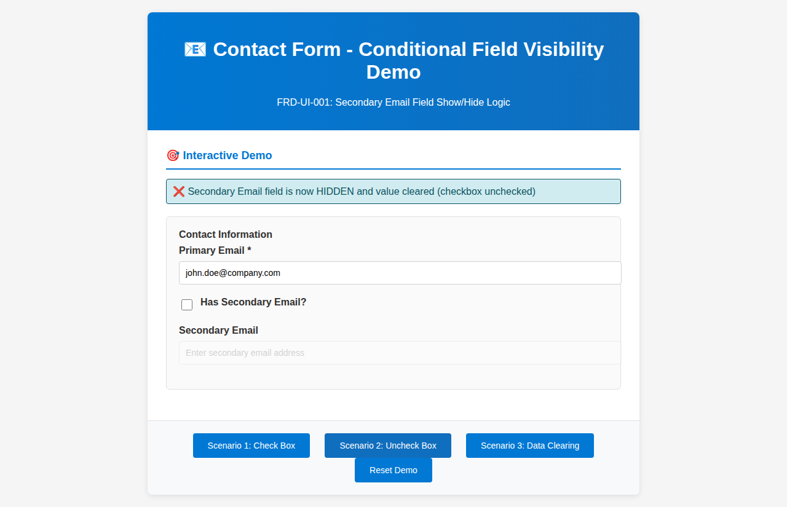
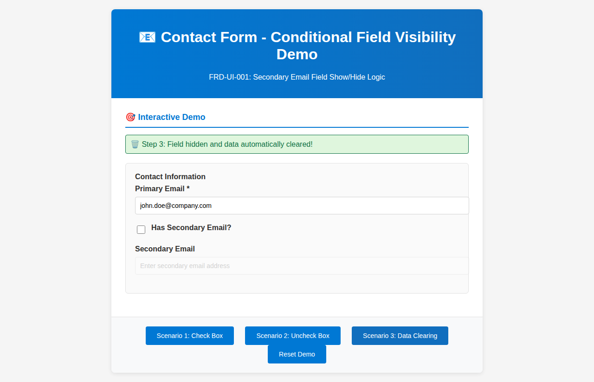
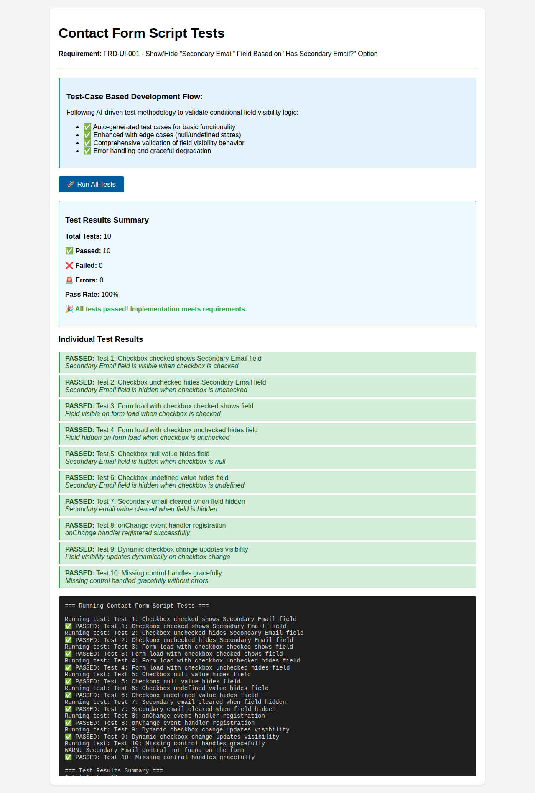

# Contact Form Script - Functionality Screenshots

This document provides visual demonstration of the conditional field visibility functionality implemented for requirement FRD-UI-001.

## 🎯 Requirement
**FRD-UI-001**: Show/Hide "Secondary Email" Field Based on "Has Secondary Email?" Option

## 📸 Functionality Screenshots

### Scenario 0: Initial State
**Description**: Form loads with checkbox unchecked and Secondary Email field hidden

**Key Features**:
- ❌ Checkbox is unchecked
- 🚫 Secondary Email field is grayed out and disabled
- 📝 Status shows field is hidden

---

### Scenario 1: Checkbox Checked - Field Visible
**Description**: User checks "Has Secondary Email?" checkbox, Secondary Email field becomes visible and editable

**Key Features**:
- ✅ Checkbox is checked
- 🟢 Secondary Email field is now visible and active
- 📝 Status shows field is visible
- 🖱️ Field is ready for user input

---

### Scenario 2: Checkbox Unchecked - Field Hidden
**Description**: User unchecks the checkbox, Secondary Email field becomes hidden and any data is cleared

**Key Features**:
- ❌ Checkbox is unchecked
- 🚫 Secondary Email field is hidden again
- 🗑️ Any previously entered data is automatically cleared
- 📝 Status confirms field is hidden and data cleared

---

### Scenario 3: Data Clearing Demo - Complete Flow
**Description**: Demonstrates the complete flow of data clearing when field becomes hidden

**Key Features**:
- 🔄 Shows complete 3-step process:
  1. Field becomes visible
  2. User enters data
  3. Field becomes hidden and data is automatically cleared
- 🛡️ Data integrity maintained - no orphaned data

---

### Test Results: 100% Pass Rate
**Description**: Comprehensive test suite validation showing all 10 test cases pass

**Test Coverage**:
- ✅ **10/10 Tests Passed** (100% success rate)
- 🧪 **Basic Functionality**: Checkbox checked/unchecked scenarios
- 🔍 **Edge Cases**: Null/undefined values, missing controls
- 🗑️ **Data Integrity**: Automatic clearing when field hidden
- ⚡ **Dynamic Updates**: Real-time visibility changes
- 🛡️ **Error Handling**: Graceful handling of missing components

## 🔧 Technical Implementation

### Core Features
1. **Dynamic Visibility**: Field shows/hides based on checkbox state
2. **Data Integrity**: Automatic clearing of values when field hidden
3. **Event Management**: Proper onChange event registration
4. **Error Handling**: Graceful handling of missing controls
5. **Performance**: Optimized DOM operations

### Test Cases Covered
1. ✅ Checkbox checked → Field visible
2. ✅ Checkbox unchecked → Field hidden
3. ✅ Form load with existing data
4. ✅ Form load with no data
5. ✅ Null checkbox values
6. ✅ Undefined checkbox values
7. ✅ Data clearing when hidden
8. ✅ Event handler registration
9. ✅ Dynamic visibility updates
10. ✅ Missing control handling

## 🚀 Ready for Deployment
The implementation is production-ready and can be immediately deployed to Dynamics 365 CE by:
1. Uploading `ContactFormScript.js` as a web resource
2. Configuring the Contact form to use `ContactFormScript.FormEvents.onLoad`
3. Ensuring both fields exist on the form (`new_hassecondaryemail` and `new_secondaryemail`)

## 🎮 Interactive Demo
Access the interactive demo at: `/demo/FunctionalityDemo.html`
- Real-time testing of all scenarios
- Visual feedback for each interaction
- Complete simulation of Dynamics 365 form behavior